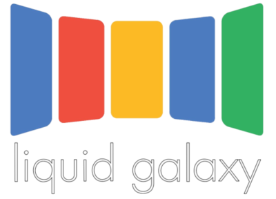
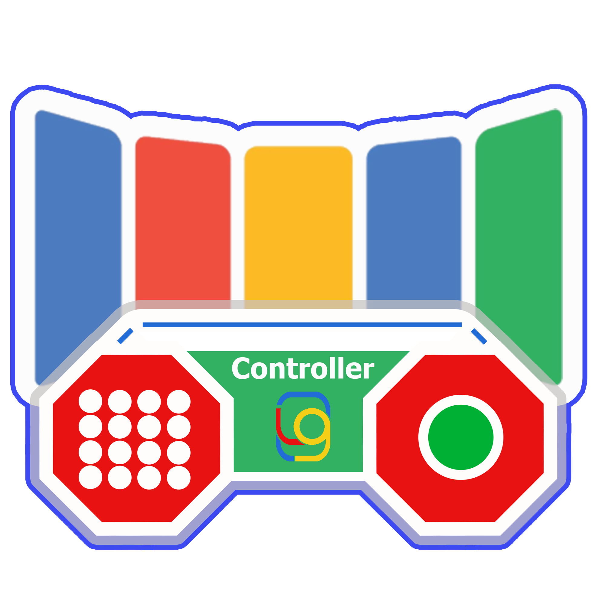
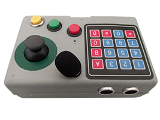
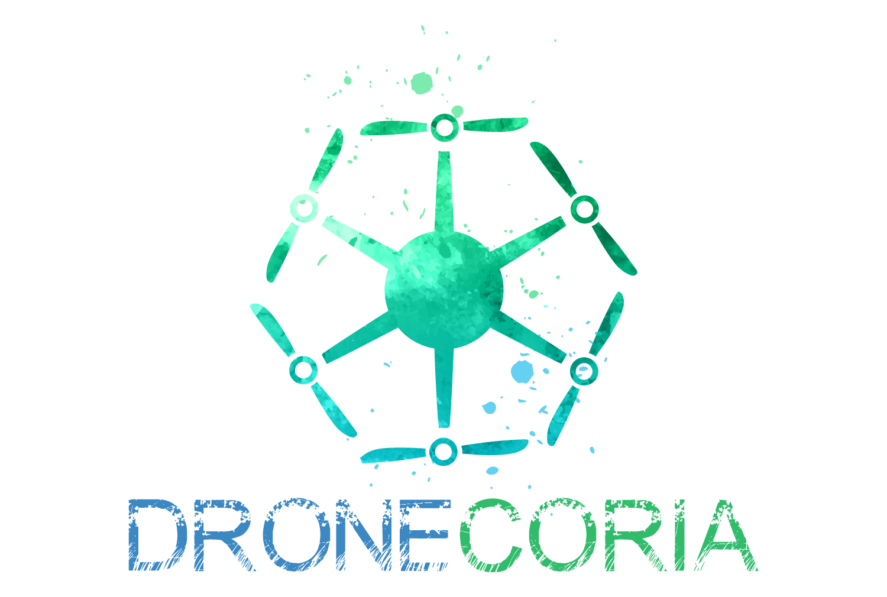

    
    

# Android Application Refurbishment
This is a Google Summer of Code 2022 project. 

Liquid Galaxy LAB has been participating in Google Summer of Code for 12 years,
and during all these years, there have been many contributors who have developed applications to be used in a Liquid Galaxy.
However, some of these applications haven’t been released to the Play Store or App Gallery.
The project's purpose is to update and upload these apps.

Here there are app sections with info:

## Image Satellite Visualizer

    

Liquid Galaxy as a meaningful presentation tool has a lot of information that can be displayed for diverse purposes like an educational tool, or for a monitoring system. 
This app shows the real time visualization of satellite images that are attached as layers of google earth, besides being able to have diverse information about the earth being graphically generated as storms, fires, masses of heat and water vapor, a synchronous earth visualization  allows for more complex interactions.

### Prerequisites
- Liquid Galaxy (To be installed, go to following github repository:  [Liquid Galaxy](https://github.com/LiquidGalaxyLAB/liquid-galaxy))
- Android phone or tablet

### Extra information
- Language code: Dart
- Deployed with Flutter
- IDE used: Android Studio

You can find Google Play Version here: [Image Satellite Visualizer](https://github.com/Alexevers/Alejandro-Android-Application-Refurbishment/tree/main/Image-Satellite-Visualizer-app)

App on Google Play Store: [Image Satellite Visualizer uploaded](https://play.google.com/store/apps/details?id=com.activity.image_satellite_visualizer&hl=es_419&gl=US) 

Doc with information about issues: [Image Satellite Visualizer issues](https://docs.google.com/document/d/1fstIQIhCp_mWrCyMncJQqXnhbPNA0kDahEPt6ftXPTc/edit?usp=sharing)

More information about original project and deployer contact: https://github.com/LiquidGalaxyLAB/image-satellite-visualizer 

## Homeless Aid Panoramic Interactive System (HAPIS)

    

HAPIS is a social project that has a very clear objective: to give people with resources the opportunity to help other people, in need, who are going through a bad situation and do not have such basic things as food or clothing.

With this application, it is intended to achieve the following objectives:

- Reduce severe material deprivation among app users.
- Provide a new help system for people without resources.
- Promote the use of espectacular technologies in everyday situations.
- Making the delivery service for basic goods faster and more effective helps people in need.
- Foster the relationship between the two main types of people, the poor and the people who can help. In this way, a new way of raising awareness could be found.

### Prerequisites
- Android phone or Tablet with 6.0 OS Version or greater
- Liquid Galaxy(__Optional__). To be installed, go to following github repository:  [Liquid Galaxy](https://github.com/LiquidGalaxyLAB/liquid-galaxy)

### Extra information
- Language code:
- IDE used: Android Studio
- BBDD: Firebase
- Google MAPS API

You can find Google Play Version here: [HAPIS](https://github.com/Alexevers/Alejandro-Android-Application-Refurbishment/tree/HAPIS)

App on Google Play Store: [HAPIS uploaded](https://play.google.com/store/apps/details?id=mihaela.claudia.diosan.gsoc2020_homelessaidpanoramicinteractivesystem&hl=es_419&gl=US) 

Doc with information about issues: there ins't a doc, because main problems with this app were caused by API keys and minor problems with SDK versions

More information about original project and deployer contact: https://github.com/LiquidGalaxyLAB/GSoC2020_HomelessAidPanoramicInteractiveSystem

## Reforestation Assistant Simulator

    

The Reforestation Assistant & Simulator idea is to create an app to help on reforestation of degraded areas of the planet by drone or manually. The project consist of an Android App where users can plan the reforesting missions, by defining areas of seeding, specific seed/tree location, drone landing points, fly zones and other helpful metrics. All the gathered information can be dynamically displayed on a Liquid Galaxy using KMLs and also on the app with the help of graphics and text to bring users a great and immersive overview of the mission panorama.

### Prerequisites
- Android phone or tablet
- Liquid Galaxy device(__Optional__)

You can find Google Play Version here: [RAS](https://github.com/Alexevers/Alejandro-Android-Application-Refurbishment/tree/RAS)

App on Google Play Store: [RAS uploaded](https://play.google.com/store/apps/details?id=com.galaxy.ras&hl=es_419&gl=US)

Doc with information about issues: [RAS issues](https://docs.google.com/document/d/1zLJIxkfdD1wFNtzuXi8hlCBdYOKFFuGbPQ2iyNf1yDI/edit?usp=sharing)

More information about original project and deployer contact: https://github.com/LiquidGalaxyLAB/reforestation-assistant-simulator

## Orbit Satellite Visualizer

    

This project aims to use the Liquid Galaxy platform to display space related concepts. You can live display single satellites by introducing its Satellite Catalog Number (SATCAT or SCN) and fixed constellations such as Iridium and Starlink. Furthermore, a database is included with satellite orbits, a sample rocket trajectory and the most important spaceports of the world.

### Prerequisites
- 10 inches tablet with an Android equal or superior to version 8.0 (Oreo). 
- Liquid Galaxy (To be installed, go to following github repository:  [Liquid Galaxy](https://github.com/LiquidGalaxyLAB/liquid-galaxy))

### Extra information
- Language code: Java
- IDE used: Android Studio

You can find Google Play Version here: [Orbit Satellite Visualizer](https://github.com/Alexevers/Alejandro-Android-Application-Refurbishment/tree/Orbit-Satellite-Visualizer)

App on Google Play Store: [Orbit Satellite Visualizer uploaded](https://play.google.com/store/apps/details?id=com.galaxy.orbitsatellitevisualizer&hl=es_419&gl=US) 

Doc with information about issues: there isn't a doc because this app had minor problems to be released.

More information about original project and deployer contact: https://github.com/moreaf/OrbitSatelliteVisualizer

## Arduino Controller App

    
    

This project consist of a remote controller for Liquid Galaxy. With this controller the user will be able to interact with Liquid Galaxy in a more dynamic way, using a remote control that can be connected to Liquid Galaxy using a USB cable or just connecting to the same internet network via WiFi. This project has two different controllers.

This project also has an Android application that should be used to personalize navigation with the developed controllers. This application has a friendly and intuitive interface, with simple commands and connections for sending data to the controllers. Using this application the user will be able to:

- Change the default navigation list of controls;
- Create personalized navigation lists with your favorite places;
- Change the tour time during the tour;
- Start the connection to the WiFi network between the controls and the Liquid Galaxy and update the network data, if necessary;
- Learn a little more about GSoC, the Liquid Galaxy community and the whole project and its collaborators on the information page.

### Prerequisites
- Liquid Galaxy (To be installed, go to following github repository:  [Liquid Galaxy](https://github.com/LiquidGalaxyLAB/liquid-galaxy))
- Android phone or tablet
- Arduino Controller

### Extra information
- Language code: Dart, C ++, Python
- Technologies: ESP32 microntroller, Various sensors
- Deployed with Flutter
- IDE used: Android Studio

You can find Google Play Version here: [Arduino Controller App](https://github.com/Alexevers/Alejandro-Android-Application-Refurbishment/tree/Arduino-Controller-App)

App on Google Play Store: [Arduino Controller App uploaded](https://play.google.com/store/apps/details?id=com.galaxy.controllerapp&hl=es_419&gl=US) 

Doc with information about issues: [Arduino Controller App issues](https://docs.google.com/document/d/1z9FDosh5Ctu1Prd5e9dIlgGHNBnFlUT4AOVUkGghhvY/edit?usp=sharing)

More information about original project and deployer contact: https://github.com/LiquidGalaxyLAB/Arduino-Controller

# Partners

    
    
      
      
       

